#Github自習メニュー

##概要

Githubを使った共同作業を実際にできるようになるまでを学ぶ。

###内容

[toc]

- [ ]共有リポジトリから自分のリポジトリへのコピー
- [ ]ブランチの作成
- [ ]ローカルにcloneする
- [ ]commitする
- [ ]mergeする
- [ ]Githubに変更を反映する
- [ ]pull requestを送る
- [ ]pull requestからのmerge
- [ ]競合の解決
- [ ][wip]なpull requestからのコードレビュー

***

##できるかな？

###共有リポジトリから自分のリポジトリへのコピー

1. まずはGithubにログイン
2. 共有リポジトリをフォーク

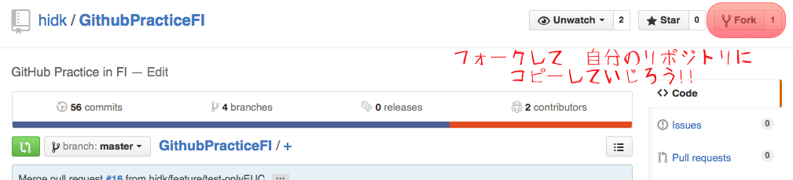

- 事故を防ぐため、共有リポジトリを個人リポジトリにforkして運用する

---

###ローカルにcloneする

Githubのリポジトリの右下の`Clone in Desktop`をクリック

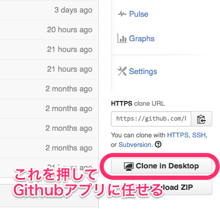

- 必ず個人リポジトリをcloneする
- 共有リポジトリcloneは禁止

---

###ブランチの作成

以下の要領で、Githubアプリでブランチ作成

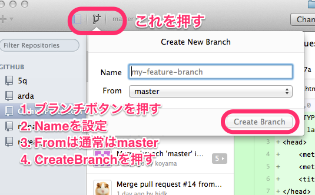

- 個人リポジトリでのブランチ運用は各自にお任せ
    - 同じ目的の修正で複数のcommitがありそうならば、ブランチを切るべき

---

###commitする

以下の要領で、Githubアプリでcommitする

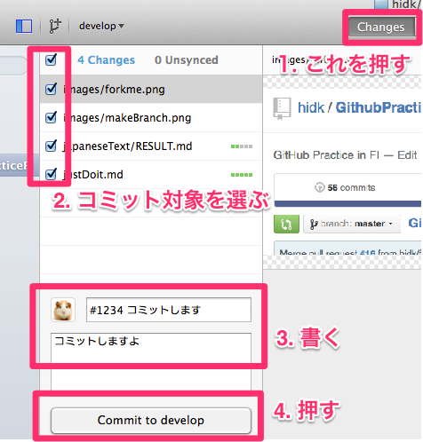

---

###mergeする

以下の要領で、Githubアプリでmergeする

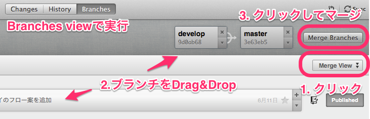

- 画像は個人リポジトリのmasterへのマージをする場合の例
    - 個人リポジトリでのブランチ運用は自由にやってOK   
- 共有リポジトリのmasterに当たるブランチへの直接マージはしない（簡単にはできない）  
  必ずpull request経由でマージする

---

###Githubに変更を反映する

Githubアプリ右上の`Sync`ボタンを押す

※画像なし

---

###pull requestを送る

以下の要領で、Githubのリポジトリへpull requestを送る

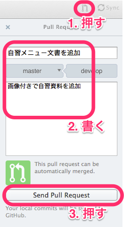

- 同じ対象のpull requestは１つしか出せない

---

###pull requestからのmerge

以下の要領で、pull requestをmergeあるいは却下する

1. Github上で、pull requestを確認

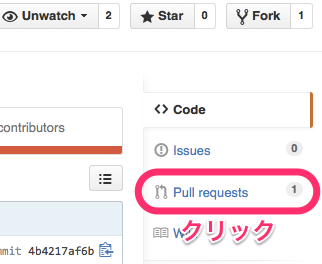

2. pull requestの詳細を確認

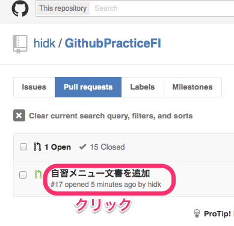

3. pull requestに対する処理を決定

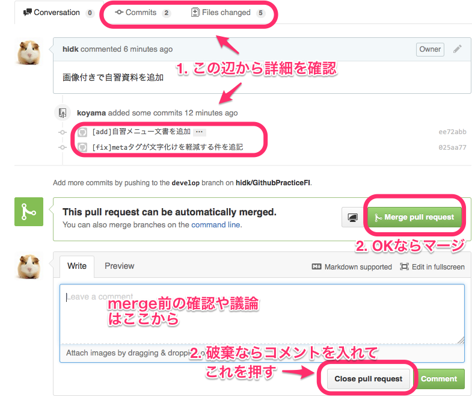

4. pull requestをmerge

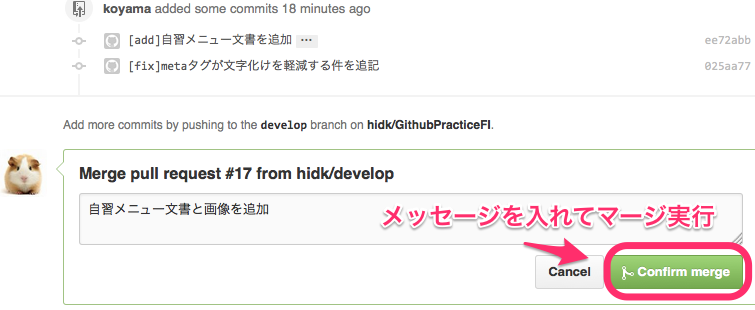

---

###競合の解決

- Githubアプリ単体では解決できない。残念
- Mecurialと同じやり方で競合解決
    - Source Tree 等と、3Way Diffツールを組み合わせて解決する

※自分で複数のブランチを作成し、わざと競合させてみる

---

###[wip]なpull requestからのコードレビュー

1. タイトルの先頭に[wip]と書いてmasterにpull request
2. 以下の要領でコメントを書く

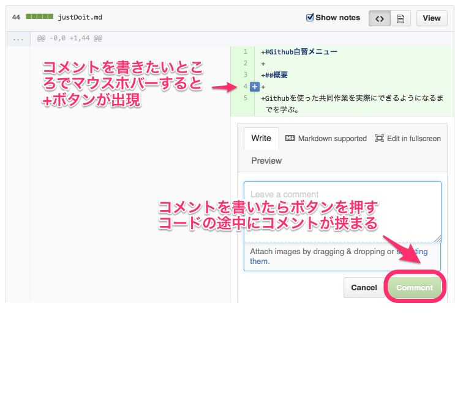

※自分でpull requestを出して、コードレビューコメントをつけてみる

***

以上  
JUST DO IT